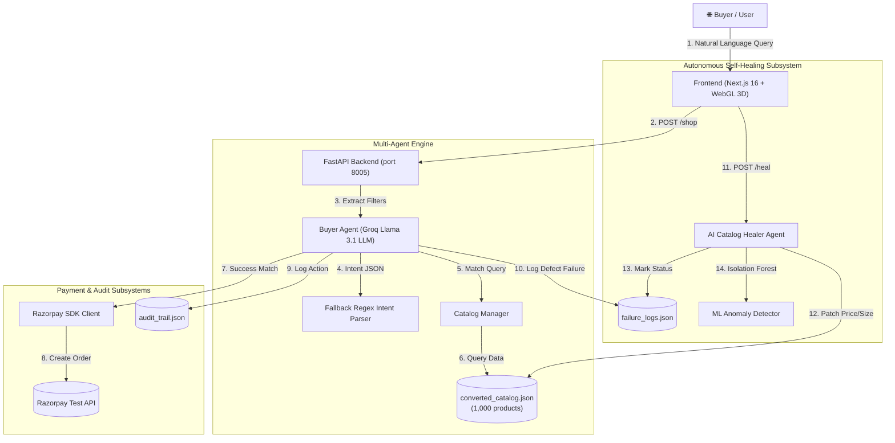
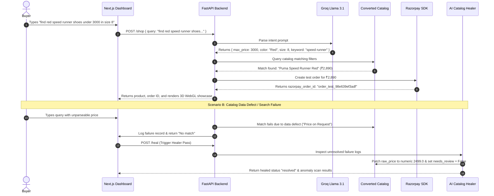

# Sentinel — System Architecture & Component Design

**Repository**: [https://github.com/sameeermokhasi/Sentinel.git](https://github.com/sameeermokhasi/Sentinel.git)  
**Branch**: `main`

---

## 1. System Architecture Diagram



---

## 2. Sequence Diagram (Shopping & Self-Healing Workflow)



---

## 3. Directory & File Structure

```text
Sentinel/
├── .env                         # API credentials (GROQ_API_KEY, RAZORPAY keys)
├── .gitignore                   # Ignore .env, node_modules, .next, __pycache__
├── requirements.txt             # Python dependencies (fastapi, uvicorn, groq, razorpay, scikit-learn)
├── PRD.md                       # Product Requirement Document
├── rules.md                     # Business rules & normalization logic
├── architecture.md              # Architecture diagrams & folder structure
│
├── agent/                       # Multi-Agent Shopping Engine
│   ├── __init__.py
│   ├── buyer_agent.py           # Natural language query matching & Razorpay integration
│   └── prompts.py               # Groq LLM system prompts & filter extraction logic
│
├── backend/                     # RESTful API Service
│   ├── __init__.py
│   └── main.py                  # FastAPI server (/shop, /heal, /catalog, /failures, /audit)
│
├── catalog/                     # Catalog Data & Conversion Engine
│   ├── __init__.py
│   ├── raw_catalog.json         # Raw messy catalog (1,000 items)
│   ├── converted_catalog.json   # Clean converted catalog (1,000 items)
│   ├── catalog_manager.py       # Normalization parser (price, size, stock, needs_review)
│   ├── generate_large_catalog.py# 1,000 product generator
│   └── generate_bulk_catalog.py # Controlled messiness (~15%) bulk generator
│
├── healer/                      # AI Self-Healing & ML Outlier Detection
│   ├── __init__.py
│   ├── failure_logs.json        # Failure log storage
│   ├── failure_logger.py        # Failure logging & status management
│   ├── catalog_healer.py        # Fixable vs Unfixable resolution agent
│   └── anomaly_model.py         # IsolationForest statistical anomaly model
│
├── payments/                    # Payment Processing
│   ├── __init__.py
│   └── razorpay_client.py       # Razorpay order generation & verification
│
├── audit/                       # Decision Auditing & Replay
│   ├── __init__.py
│   ├── audit_trail.json         # Timestamped decision log storage
│   └── audit_trail.py           # Audit logging engine
│
└── frontend/                    # Next.js 16 Three.js 3D WebGL Dashboard
    ├── package.json             # Next.js, Three.js, React Three Fiber dependencies
    ├── next.config.mjs          # Next.js configuration
    ├── app/                     # Next.js App Router pages (/shop, /healer, /catalog, /failures, /audit)
    ├── components/              # UI Components
    │   ├── product-visual.tsx   # Three.js WebGL 3D Rotating Showcase Panel canvas
    │   ├── product-image.tsx    # 3D WebGL visual wrapper component
    │   ├── agent-console.tsx    # Buyer agent search console
    │   ├── catalog-grid.tsx     # Catalog item grid
    │   └── healer-console.tsx   # Healer triggers & anomaly scan UI
    ├── lib/                     # API client utilities
    │   ├── sentinel-api.ts      # Sentinel REST API client hooks
    │   └── api-base.ts          # API base URL configuration (http://localhost:8005)
    └── public/                  # Static assets & product images
        └── products/            # High-resolution Puma Speedcat product assets
```

---

## 4. API Specification Summary

| Method | Endpoint | Description | Request Body / Query |
| :--- | :--- | :--- | :--- |
| `GET` | `/` | API Root Health Check | — |
| `POST` | `/shop` | Run Buyer Agent Intent Matching | `{"query": "string"}` |
| `POST` | `/heal` | Trigger AI Healer & Anomaly Scan | — |
| `GET` | `/catalog` | Retrieve Converted Catalog Items | — |
| `GET` | `/failures` | Retrieve Structured Failure Logs | — |
| `GET` | `/audit` | Retrieve Timestamped Audit Trail | — |

---

## 5. GitHub Repository Link
* **URL**: [https://github.com/sameeermokhasi/Sentinel.git](https://github.com/sameeermokhasi/Sentinel.git)
* **Branch**: `main`
